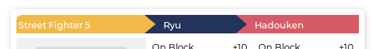

# Data Design
* [Published Documents](#published-documents)
* [Proposals](#proposals)
* [Tag Sets](#tag-sets)
* [Indices](#database-indices)

## Published Documents

These documents represent the published / live data displayed on the site: Game, Character and Move data.

### Ids
Document ids take on the following 'chain format' so that their ancestries are immediately apparent. Each component of an id should be abbreviated as much as possible.

| Type     | Id Format            |
|----------|----------------------|
| Game     | `game`               |
| Character| `game.character`     |
| Move     | `game.character.move`|

An example of the move 'Hadoken' for character 'Ryu' in 'Street Fighter 5':
```
sf5.ryu.hadoken
```

### Relationships
Child documents contain references to their parents to allow for quick backward navigation as seen in the following example `move` UI component:



It also allows one to list downwards. For example to display all `moves` for a `character` in the browser, the following N1QL query can be executed and the results fed into a UI component:
   ```
   SELECT * FROM `published` AS doc
   WHERE character="sf5.ryu" AND type="move"
   ```

`Move` documents are children to only `character` documents:
```js
{
  "title": "Hadoken",
  "type": "move"
  "character": "sf5.ryu",
  ...
}
```

`Character` documents are children to only `game` documents:
```js
{
  "title": "Ryu",
  "type": "character"
  "game": "sf5",
  ...
}
```

`Game` documents are at the root so no references are required:
```js
{
  "title": "Street Fighter 5",
  "type": "game"
  ...
}
```

### Examples

`sf5`
```js
{
  "title": "Street Fighter 5",
  "type": "game"
}
```

`sf5.ryu`
```js
{
  "title": "Ryu",
  "type": "character",
  "game": "sf5"
  "attributes": [
    {
      "title": "health",
      "value": "1000"
    },
    {
      "title": "stun",
      "value": "1100"
    }
  ]
}
```

`sf5.ryu.hadoken`
```js
{
  "title": "Hadoken",
  "type": "move",
  "character": "sf5.ryu",
  "attributes": [
    {
      "title": "On Block",
      "value": "-2",
      "sentiment": "negative"
    },
    {
      "title": "On Hit",
      "value": "+5",
      "sentiment": "positive"
    },
    {
      "title": "Start Up",
      "value": "25"
    }
  ]
}
```

## Proposals

Proposals represent *new documents* or *changes to documents* that have not yet been approved and as a result published. The proposal contains the proposed document as well some meta data to manage it.

### Examples
Below is an example of a pending game proposal awaiting approval:
```js
{
  "lastUpdated": 1532993717,
  "target": "sf4",
  "status": "pending",
  "document": {
    "title": "Street Fighter V",
    "attributes": [
      {
        "title": "Year",
        "value": "1991",
        "sentiment": "neutral"
      }
    ]
  }
}
```

The target field contains the id of the new document or an existing document to update once published.

### Ids
The id of a proposal itself is the target property value plus the version.
As an example the fourth proposal created for document sf4 will have the id `sf4::4`.

## Tag Sets
Tag sets contain a collection of tags for published documents to facilitate searching. A document's `tags` and the tags of all its parents (`parentTags`) are stored in a tag set. A tag set is updated whenever a new version of a document or one of its parents is published. See [tag sets adapter](../server/src/database_adapters/couchbase/tag_sets.rs).

### Examples
Example of a tag set for the character "Ryu":
```js
{
  "game": "sf5",
  "parentTags": [
    "Street Fighter V",
    "sf5"
  ],
  "tags": [
    "Ryu"
  ],
  "type": "tagset"
}
```

## Database Indices
To support querying documents for our use cases see the indices defined in the [couchbase/n1ql](../couchbase/n1ql) directory.
